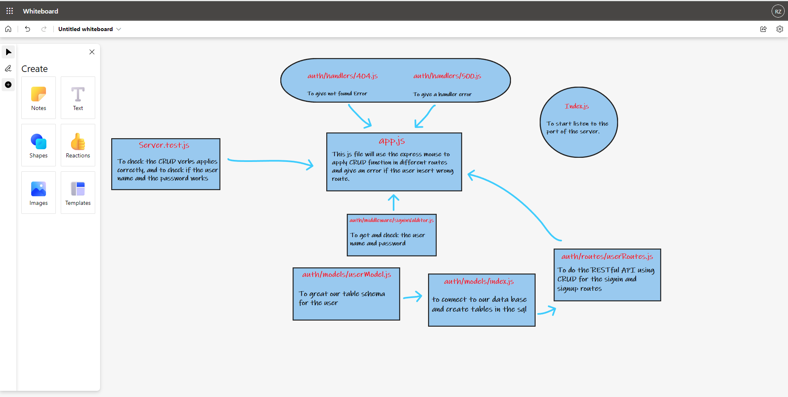

# basic-auth

## Author: Rami Zregat

## Project:

## Lab 4

**Description of today lab:**   

## Links to check:  

- Heroku application for main branch: https://ramizregat-basic-auth.herokuapp.com/

- Github actions link: https://github.com/RamiZregat/basic-auth/actions

- Github pull request link: https://github.com/RamiZregat/basic-auth/pull/3

## Dependencies:

- dotenv
- express
- jest
- supertest
- pg
- sequelize
- sequelize-cli
- sqlite3
- base-64
- bcrypt

## How to start the server:  
- pgstart
- npm start

## What should I run on the terminal or postman?

- npm run test / on the terminal

- GET - http://localhost:3030/

- POST - http://localhost:3030/signin

- POST - http://localhost:3030/signup

## UML

